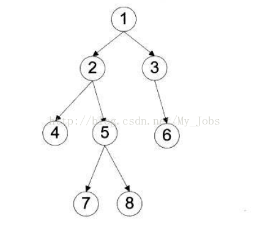
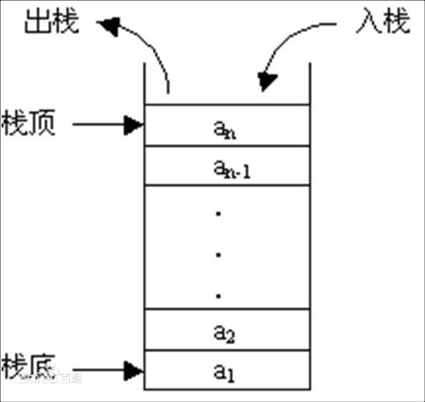

# 计算机二级笔记 

# 目录
## [树](#tree)
## [算法](#algorithm)
## [链表](#linked)
## [栈](#stack)
## [队列](#queue)
## [数据库](#database)
## [计算机网络](#net)
## [计算机组成原理](#computer)
## [计算机的存储和运算](#data)
## [软件工程](#software)
## [ASP](#asp)
## [JSP](#jsp)
## [web速记](#web)

## 树
树是n（n>=0）个结点的有限集        

1. 树中一个结点的孩子个数称为该结点的度,树中结点的最大度数称为树的度    .    
2. 度大于0的结点称为分支结点(又称非终端结点);度为0(没有子女结点)的结点称为叶子结点(又称终端结点)。在分支结点中,每个结点的分支数就是该结点的度。
3. - 结点的深度是从根结点开始自顶向下逐层累加的。
   - 结点的高度是从叶结点开始自底向上逐层累加的。
   - 树的高度(或深度)是树中结点的最大层数。
4. 有序树和无序树。树中结点的各子树从左到右是有次序的,不能互换,称该树为有序树,否则称为无序树
5. 路径和路径长度。树中两个结点之间的路径是由这两个结点之间所经过的结点序列构成的,而路径长度是路径上所经过的边的个数。
6. 森林。森林是m(m≥0)棵互不相交的树的集合。

    #### 树的性质
    1. 树中的结点数等于所有结点的度数加1.
    2. 度为m的树中第i层上最多有mi-1个节点(i>=1)。
    3. 高度为h的m叉树至多有(mh-1)/(m-1)个结点。
    4. 具有n个结点的m叉数的最小高度为[logm(n(m-1)+1)]  

### 二叉树
#### 二叉数的遍历

**前序遍历**：根结点 ---> 左子树 ---> 右子树   
**中序遍历**：左子树 ---> 根结点 ---> 右子树    
**后序遍历**：左子树 ---> 右子树 ---> 根结点   
      
**前序遍历**：1  2  4  5  7  8  3  6    
**中序遍历**：4  2  7  5  8  1  3  6    
**后序遍历**：4  7  8  5  2  6  3  1
  
### 程序的执行方式
1. **顺序**执行
    - **可再现性**             
        处理机严格地按照程序所规定的顺序执行，即每一操作必须在下一个操作开始之前结束
    - **封闭性**         
        程序在封闭的环境下运行，即程序运行时独占全机资源，资源的状态（除初始状态外)只有本程序才能改变它，程序一旦开始执行，其执行结果不受外界因素影响
    - **可再现性**           
    指只要程序执行时的环境和初始条件相同，当程序重复执行时，不论它是从头到尾不停顿地执行，还是“停停走走”地执行，都可获得相同的结果程序顺序执行时的这种特性，为程序员检测和校正程序的错误带来了很大的方便
2. **并发**执行
    - **间断性**        
    程序在并发执行时，由于它们共享系统资源，以及为完成同一项任务而相互合作，致使在这些并发执行的程序之间形成了相互制约的关系。相互制约将导致并发程序具有“执行-暂停-执行”这种间断性的活动规律。
    - **失去封闭性**          
    当系统中存在着多个可以并发执行的程序时，系统中的各种资源将为它们所共享，而这些资源的状态也由这些程序来改变，致使其中任一程序运行时，其环境都必然受到其他程序的影响。
    - **不可再现性**           
    程序在并发执行时，由于失去了封闭性，其计算结果必将与并发程序的执行速度有关，从而使程序的执行失去了可再现性。换而言之，程序经过多次执行后，虽然它们执行时的环境和初始条件相同，但得到的结果却各不相同。

    
## <a id="algorithm">算法</a>

### 算法的复杂度
- 复杂度分析   
通常一个算法的复杂度是由其输入量决定的
- 时间复杂度      
执行算法所需要的计算工作量
- 空间复杂度     
算法在计算机内执行时所需存储空间的度量

### 排序算法

## <a id="linked">链表</a>
链表是一种物理存储单元上**非连续**、**非顺序**的存储结构

### 单链表
>单向链表（又名单链表、线性链表）是链表的一种，其特点是链表的链接方向是**单向**的，对链表的访问要通过从**头部**开始，依序往下读取。
### 双链表
>双向链表，又称为双链表，是链表的一种，它的每个数据结点中都有两个指针，分别指向直接后继和直接前驱。所以，从双向链表中的任意一个结点开始，都可以很方便地访问它的前驱结点和后继结点。一般我们都构造双向循环链表。
### 有序链表

### 循环链表

## <a id="stack">栈</a>
只允许在一端进行插入或删除操作的线性表。首先，栈是一种线性表，但限定这种线性表只能在某一段进行插入和删除操作。

栈顶（**Top**）：线性表允许进行插入和删除的一端。

栈底（**Bottom**）：固定的，不允许进行插入和删除的另一端。

空栈：不含任何元素。   

栈空条件：S.top == -1

栈满条件：S.top == MAXSIZE - 1

栈长：S.top + 1

## <a id="queue">队列</a>
一种特殊的线性表,它只允许在表的前端（front）进行删除操作，而在表的后端（rear）进行插入操作。进行插入操作的端称为队尾，进行删除操作的端称为队头。队列中没有元素时，称为空队列。

#### 结构化程序设计和结构化程序设计方法 
结构化程序设计适用于程序规模较大的情况，对于规模较小程序也可采用非结构化程序设计方法。       
1.  - 结构化程序设计是进行以**模块功能**和**处理过程**设计为主的详细设计的基本原则
    - 结构化程序设计方法是按照模块划分原则以提高程序**可读性**和**易维护性**、**可调性**和**可扩充性**为目标的一种程序设计方法
2. 原则
    - 自顶向下
    - 逐步细化
    - 模块化
    - 结构化编码
   
    
    
    
    
    
    
    
    
    

## <a id="database">数据库</a>

### 数据库管理技术发展的三个阶段
1. 人工管理阶段   
20世纪50十年代中期以前，计算机主要用于科学计算，由**人工**进行数据管理。
    - 数据不保存
    - 应用程序管理数据
    - 数据不共享
    - 数据不具有独立性
2. 文件系统管理阶段   
20世纪50年代后期到60年代中期，这时硬件方面有了磁盘、磁鼓等直接存取存储设备；软件方面，操作系统中已经有了专门的数据管理软件。一般称为文件系统，处理方式上不仅有批处理，而且能够联机实时处理。
    - 数据可以长期保存
    - 由文件系统管理数据
    - 数据共享性差，冗余度大
    - 数据独立性差
3. 数据库系统阶段   
20世纪60年代，这时硬件已有大量容量磁盘，硬件价格下降，软件价格上升。处理文件方式上，人们越来越需要联机实时处理。在这种背景下就诞生了统一管理数据的专门软件系统——数据库管理系统。
    - 数据结构化
    - 数据的共享性高，冗余度低且易扩充
    - 数据独立性高
    - 数据由数据库管理系统统一管理和控制

### E-R图(实体-联系模型)
实体：客观存在且可以互相区别的事物。
属性：实体的特征描述。

### 数据库的三范式
1. 第一范式  
表中的每一列都不可再分
2. 第二范式  
表中的非主键列与的主键列相关
3. 第三范式  
表中的非主键列与主键列直接相关

## <a id="net">计算机网络</a>
   
### 基础概念
#### 物理层
>该层为上层协议提供了一个传输数据的可靠的物理媒体。简单的说，物理层确保原始的数据可在各种物理媒体上传输。
#### 数据链路层
>在不可靠的物理介质上提供可靠的传输。
#### 网络层
>提供路由和寻址的功能，使两终端系统能够互连且决定最佳路径，并具有一定的拥塞控制和流量控制的能力。

- IP协议
#### 传输层
>将上层数据分段并提供端到端的、可靠的或不可靠的传输。
- TCP协议
- UDP协议
#### 会话层
>会话层管理主机之间的会话进程，即负责建立、管理、终止进程之间的会话。
#### 表示层
>对上层数据或信息进行变换以保证一个主机应用层信息可以被另一个主机的应用程序理解。
#### 应用层
>为操作系统或网络应用程序提供访问网络服务的接口。
- FTP协议
- DNS协议
- HTTP协议
- POP3协议
- Telnet协议

### HTTP状态码
:boom: :boom:响应分为五类：信息响应(100–199)，成功响应(200–299)，重定向(300–399)，客户端错误(400–499)和服务器错误 (500–599)

|分类|分类描述|
|:-:|:-:|
|1**|信息，服务器收到请求，需要请求者继续执行操作|
|2**|成功，操作被成功接收并处理|
|3**|重定向，需要进一步的操作以完成请求|
|4**|客户端错误，请求包含语法错误或无法完成请|
|5**|服务器错误，服务器在处理请求的过程中发生了错误|

#### 信息响应
|状态码|名称|描述|
|:-:|:-:|:-:|
|100|Continue|这个临时响应表明，迄今为止的所有内容都是可行的，客户端应该继续请求|
|101|Switching Protocols|指明服务器即将切换的协议|
|102|Processing|服务器已收到并正在处理该请求，但当前没有响应可用|

#### 成功响应
|状态码|名称|描述|
|:-:|:-:|:-:|
|200|OK|请求成功|
|201|Created|该请求已成功，并因此创建了一个新的资源|
|202|Accepted|请求已经接收到，但还未响应，没有结果|
|203|Non-Authoritative Information|服务器已成功处理了请求，但返回的实体头部元信息不是在原始服务器上有效的确定集合，而是来自本地或者第三方的拷贝|
|204|No Content|对于该请求没有的内容可发送，但头部字段可能有用|
|205|Reset Content|告诉用户代理重置发送此请求的文档|
|206|Partial Content|当从客户端发送Range范围标头以只请求资源的一部分时，将使用此响应代码|

#### 重定向消息
|状态码|名称|描述|
|:-:|:-:|:-:|
|300|Multiple Choice|请求拥有多个可能的响应|
|301|Moved Permanently|请求资源的 URL 已永久更改|
|302|Found|此响应代码表示所请求资源的 URI 已暂时更改|
|303|See Other|服务器发送此响应，以指示客户端通过一个`GET`请求在另一个`URI`中获取所请求的资源|
|304|Not Modified|用于缓存的目的。它告诉客户端响应还没有被修改，因此客户端可以继续使用相同的缓存版本的响应|
|307|Temporary Redirect|服务器发送此响应，以指示客户端使用在前一个请求中使用的相同方法在另一个`URI`上获取所请求的资源|

#### 客户端错误响应
|状态码|名称|描述|
|:-:|:-:|:-:|
|400|Bad Request|由于被认为是客户端错误（例如，错误的请求语法、无效的请求消息帧或欺骗性的请求路由），服务器无法或不会处理请求|
|401|Unauthorized|客户端必须对自身进行身份验证才能获得请求的响应|
|403|Forbidden|客户端没有访问内容的权限(与 401 Unauthorized 不同，服务器知道客户端的身份)|
|404|Not Found|服务器找不到请求的资源|
|405|Method Not Allowed|服务器知道请求方法，但目标资源不支持该方法|
|406|Not Acceptable|没有发现任何符合用户代理给定标准的内容|
|407|Proxy Authentication Required|类似于 401 Unauthorized 但是认证需要由代理完成|
|408|Request Timeout|此响应由一些服务器在空闲连接上发送，即使客户端之前没有任何请求|
|409|Conflict|请求与服务器的当前状态冲突|
|410|Gone|请求的内容已从服务器中永久删除且没有转发地址|
|411|Length Required|服务端拒绝该请求,因为没有`Content-Length`头部字段|
|412|Precondition Failed|客户端在其头文件中指出了服务器不满足的先决条件|
|413|Payload Too Large|请求实体大于服务器定义的限制|
|414|URI Too Long|客户端请求的`URI`比服务器愿意接收的长度长|
|415|Unsupported Media Type|服务器不支持请求数据的媒体格式|
|416|Range Not Satisfiable|该范围可能超出了目标`URI`数据的大小|
|417|Expectation Failed|此响应代码表示服务器无法满足`Expect`请求标头字段所指示的期望|

#### 服务端错误响应
|状态码|名称|描述|
|:-:|:-:|:-:|
|500|Internal Server Error|服务器遇到了不知道如何处理的情况|
|501|Not Implemented|服务器不支持请求方法，因此无法处理|
|502|Bad Gateway|服务器作为网关需要得到一个处理这个请求的响应，但是得到一个错误的响应|
|503|Service Unavailable|服务器没有准备好处理请求|
|504|Gateway Timeout|服务器充当网关且无法及时获得响应|
|505|HTTP Version Not Supported|服务器不支持请求中使用的 HTTP 版本|

### HTTP请求方法
|方法|语义|
|:-:|:-:|
|**GET**|`GET`方法请求一个指定资源的表示形式，使用`GET`的请求应该只被用于获取数据。|
|**HEAD**|`HEAD`方法请求一个与`GET`请求的响应相同的响应，但没有响应体。|
|**POST**|`POST`方法用于将实体提交到指定的资源，通常导致在服务器上的状态变化或副作用。|
|**PUT**|`PUT`方法用请求有效载荷替换目标资源的所有当前表示。|
|**DELETE**|`DELETE`方法删除指定的资源。|
|**CONNECT**|`CONNECT`方法建立一个到由目标资源标识的服务器的隧道。|
|**OPTIONS**|`OPTIONS`方法用于描述目标资源的通信选项。|
|**TRACE**|`TRACE`方法沿着到目标资源的路径执行一个消息环回测试。|
|**PATCH**|`PATCH`方法用于对资源应用部分修改。|

## <a id="computer">计算机组成原理</a>

### 系统组成
- 运算器  
计算机中执行各种算术和逻辑运算操作的部件  
- 控制器  
计算机的神经中枢，指挥全机中各个部件自动协调工作
- 存储器  
计算机系统中的记忆设备，用来存放程序和数据
- 输入设备
- 输出设备

### 存储系统

### I/O方式
#### 程序查询
>指信息交换的控制完全由主机执行程序实现，程序查询方式接口中设置一个数据缓冲寄存器和状态寄存器。主机进行 I/O 操作时，先询问设备状态，根据设备状态决定下一步操作是进行数据传输还是等待。
- 特点：CPU 有“踏步”等待现象，CPU 与 I/O 串行工作。
- 优点：接口设计简单、设备量少。
- 缺点：信息传输过程中 CPU 等待的时间较多，一段时间内只能和一台外设交换信息，效率较低。

#### 程序中断
>指计算机执行现行程序过程中，出现某些急需处理的情况或特殊请求，CPU 暂停现行程序转而去处理那些异常情况或特殊请求，处理完毕后 CPU 又自动返回现行程序的断点处继续执行原程序剩下的操作。
- 优点：使处理器的利用率提高，且能支持多道程序和I/O设备的并行操作。
- 缺点：缓冲区装满数据之后将会发生中断，消耗CPU处理时间；中断次数的急剧增加会造成CPU无法响应中断和出现数据丢失现象。

#### DMA
>它允许某些电脑内部的硬件子系统（电脑外设），可以独立地直接读写系统内存，而不需中央处理器（CPU）介入处理 。
- 
- 
#### 通道

#### 虚拟存储器

### 杂项
- :boom: :boom:在操作系统中，将文件名转换为文件存储地址的结构是文件目录，文件目录是计算机系统建立的文件索引，是文件名和文件物理位置之间的映射关系。
#### 虚拟内存

## <a id="data">计算机的存储和运算</a>

### 二进制数字
>二进制（binary）在数学和数字电路中指以2为底数的记数系统，以2为基数代表系统是二进位制的。这一系统中，通常用两个不同的数字0和1来表示。数字电子电路中，逻辑门直接采用了二进制，因此现代的计算机和依赖计算机的设备里都用到二进制。每个数字称为一个比特（二进制位）或比特（Bit，Binary digit 的缩写）。
### 原码
>原码是指一个二进制数左边加上符号位后所得到的码，且当二进制数大于0时，符号位为0；二进制数小于0时，符号位为1；二进制数等于0时，符号位可以为0或1(+0/-0)
### 反码
>对于单个数值（二进制的0和1）而言，对其进行取反操作就是将0变为1，1变为0。

正数的反码是其本身，负数的反码是在其**原码**的基础上，符号位不变，其余各个位取反。
### 补码
正数的补码就是其本身,负数的补码是在其**原码**的基础上，符号位不变，其余各位取反，最后+1。(也即在反码的基础上+1)  
:boom: :boom: **在计算机系统中，数值一律用补码来表示和存储。原因在于，使用补码，可以将符号位和数值域统一处理；同时，加法和减法也可以统一处理**

## <a id="software">软件工程</a>

### 三要素
- 方法 
- 工具
- 过程

## <a id="asp">ASP</a>
>动态服务器网页（英文：Active Server Pages，简称ASP），是由微软公司开发的**服务器端运行**的**脚本平台**，它被Windows下Internet Information Services (**IIS**)的程序所管理。透过ActiveX server的技术让不同的用户能有不同的画面，或需要让他们可以访问服务器（server）上的资料时，使用ASP3.0中提供了五个内置的对象创建模拟和安全性的动态内容，来协助程序员隐藏复杂的沟通机制，让程序员可以专注在解决问题和应用之上，这样可以更快速地开发**动态网页**的同时每一个组件都是可以由一组富有经验的程序员根据动态网页最常用的功能而独立开发。

## <a id="jsp">JSP</a>
>JSP（全称Jakarta Server Pages，曾称为JavaServer Pages）是由Sun Microsystems公司主导创建的一种**动态网页技术标准**。**JSP**部署于**网络服务器**上，可以响应客户端发送的请求，并根据请求内容**动态地生成**HTML、XML或其他格式文档的Web网页，然后返回给请求者。JSP技术以**Java**语言作为**脚本语言**，为用户的HTTP请求提供服务，并能与服务器上的其它Java程序共同处理复杂的业务需求。

## <a id="web">web速记</a>
- location接口(部分)

    |属性|语义|
    |:-:|:-:|
    |href|包含**整个URL**的一个DOMString|
    |host|包含了**域名**的一个DOMString，可能在该串最后带有一个":"并跟上 URL 的**端口号**|
    |hostname|包含**URL域名**的一个DOMString|
    |port|包含**端口号**的一个DOMString|
    |pathname|包含 URL 中**路径部分**的一个DOMString，开头有一个/|
    
- 